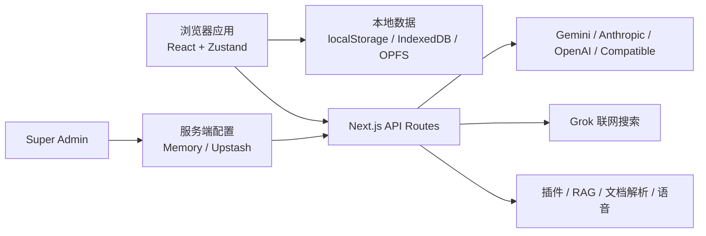

# Neo Chat

<p align="center">
  
</p>

<p align="center">
  <strong>面向自部署场景的本地优先、多模型 AI 对话工作台</strong>
</p>

<p align="center">
  
  
  
  
  <a href="LICENSE"></a>
</p>

Neo Chat 是基于 [u14app/neo-chat](https://github.com/u14app/neo-chat)
持续二次开发的 AI 对话项目。它保留了上游项目本地优先、多供应商、插件、
Skills、知识库和语音能力，并围绕实际自部署体验重新完善了服务端模型管理、
Grok 联网搜索、Anthropic 接入、流式交互、消息排队、错误透传和内容导出。

项目适合个人、团队内网或受控站点部署。对话、设置、工作区、技能、插件和
知识库元数据默认保存在浏览器本地；模型请求、联网搜索、插件执行、RAG、
文档解析和语音能力通过 Next.js API 路由统一代理。

## 版本重点

| 方向           | 当前实现                                                                                      |
| -------------- | --------------------------------------------------------------------------------------------- |
| 服务端模型管理 | 新增 `/superadmin` 管理页，可集中添加、编辑、启停模型供应商并拉取模型列表                     |
| 管理权限       | `SUPERADMIN_PASSWORD` 独立保护超级管理员页面和管理 API，与站点访问密码分离                    |
| 配置持久化     | 本地部署支持内存存储，托管或多实例部署可使用 Upstash 保存模型与 Grok 配置                     |
| Grok 联网      | 使用管理员统一配置的 Grok/OpenAI Responses 兼容接口，支持模型工具调用、多轮检索和显式错误展示 |
| MCP 工具       | 支持 Registry 与自定义远程 `streamable-http` 服务、工具确认、资源、提示词、Roots 和会话通知   |
| 模型供应商     | 在 Gemini、OpenAI 和 OpenAI Compatible 基础上补充 Anthropic 原生请求与流式响应支持            |
| 对话体验       | 支持生成过程中继续输入并排队发送，修复停止生成后的残留状态                                    |
| 流式性能       | 优化长回答渲染、消息提交和自动滚动，用户主动上滑后不会被强制拉回底部                          |
| 兼容与诊断     | 修复 OpenAI 多轮消息格式，增加主模型与 Grok 请求超时，并保留上游真实错误信息                  |
| 内容导出       | 单条回答可导出 Markdown、PNG 或 PDF；视觉导出只保留正文与图片，不混入思考和工具详情           |
| 界面调整       | 支持切换对话消息位置、动态用户消息宽度，并精简不适合当前项目的设置入口                        |

## 核心能力

- 支持 Gemini、Anthropic、OpenAI 和 OpenAI Compatible 模型供应商。
- 支持服务端统一模型配置，也支持用户在浏览器内配置自己的 API Key。
- 支持文本、图片、附件、推理内容、工具调用和混合内容流式输出。
- 支持具备图像能力的模型进行图片生成与图片编辑。
- 支持会话分支、置顶、搜索、工作区、工作区文件和自定义系统提示词。
- 支持助理预设、本地自定义助理和 LobeHub 助理市场数据。
- 支持文本型 Skills 的安装、编辑、自定义、手动选择和自动选择。
- 支持 OpenAPI 风格插件，以及网页读取、图片处理、视频生成等内置工具。
- 支持 Registry 与自定义远程 `streamable-http` MCP 服务；提供 Bearer、API Key、
  OAuth Access Token、静态 Header、Roots、Resources、Prompts、能力刷新和订阅操作。
- MCP 写入、破坏性及外部工具默认逐次确认，可对明确可信的 MCP 服务关闭逐次确认；
  当前不支持本地 stdio 进程，也不提供 OAuth PKCE 登录流程。
- 支持管理员统一启用 Grok 联网搜索，模型可按需发起一次或多次检索。
- 支持知识库 RAG、OPFS 文件存储、MinerU/LlamaParse 文档解析和外部向量服务。
- 支持本地记忆、记忆检索、后台提取与梦境整合。
- 支持浏览器语音能力、ElevenLabs、Mimo 或兼容语音服务。
- 支持 Markdown、GFM 表格、数学公式、代码高亮、Mermaid、思维导图、引用来源、
  HTML 视觉块、音频、图片和 Artifact 渲染。
- 支持本地数据导出、对话导出和单条回答的 Markdown/PNG/PDF 下载。
- 支持 Docker、Vercel 和 Cloudflare Workers 部署。

## 项目截图


## 快速开始

### 环境要求

- Node.js 22
- pnpm 10.30.3

项目已在 `package.json` 中固定 pnpm 版本，建议通过 Corepack 使用。

```bash
corepack enable
corepack pnpm install
corepack pnpm dev
```

访问 `http://localhost:3000`，然后在设置中添加模型供应商，或通过
`/superadmin` 配置站点级模型。

如需使用环境变量，复制模板后按需修改：

```bash
cp .env.example .env.local
```

完整字段和中文注释见 [.env.example](.env.example) 与
[环境变量文档](docs/environment-variables.md)。

## Super Admin

二开版本新增了独立的超级管理员入口：

```text
http://localhost:3000/superadmin
```

最小本地配置：

```bash
SUPERADMIN_PASSWORD="change-this-password"
MODEL_PROVIDER_STORE="memory"
```

登录后可以：

- 添加、编辑、删除和启停站点级模型供应商；
- 配置 Gemini、Anthropic、OpenAI 或 OpenAI Compatible 接口；
- 从供应商接口拉取模型列表并选择对用户开放的模型；
- 配置 Grok 联网搜索的 Base URL、API Key 和模型；
- 测试 Grok 连接状态并控制是否向聊天开放联网能力。

`SUPERADMIN_PASSWORD` 只负责保护管理后台。若还需要保护整个站点，请另外设置：

```bash
ACCESS_PASSWORD="site-access-password"
```

内存存储只适合本地单实例运行，进程重启后管理配置会丢失。托管环境必须使用
共享存储：

```bash
DEPLOYMENT_MODE="hosted"
MODEL_PROVIDER_STORE="upstash"
UPSTASH_REDIS_REST_URL="https://..."
UPSTASH_REDIS_REST_TOKEN="..."
```

## Grok 联网搜索

本项目使用管理员统一配置的 Grok 联网能力，不再让普通用户分别维护搜索服务
密钥。配置完成并启用后，聊天输入框会出现“Grok 联网搜索”选项。

- 文本模型通过 `grok_web_search` 工具自主决定搜索关键词和搜索轮次；
- 搜索结果以结构化来源返回，并在回答中展示引用；
- 不支持工具调用的图片模型会使用预检索流程；
- 配置缺失、请求失败或工具执行失败都会明确展示，不会静默忽略；
- Grok 请求超时可通过 `GROK_SEARCH_TIMEOUT_MS` 配置。

Grok 接口需要兼容 OpenAI Responses API，并由管理员在 `/superadmin` 中配置，
当前没有搜索环境变量兜底。

## 部署

### Docker Compose

```bash
docker compose up --build
```

默认访问地址为 `http://localhost:3000`。生产部署时应配置稳定 BYOK 私钥、访问
密码和共享存储，不要将密钥直接写入仓库。

### Docker

```bash
docker build -t neo-chat:local .
docker run --rm -p 3000:3000 \
  -e BYOK_ALLOW_EPHEMERAL_KEY=true \
  neo-chat:local
```

`BYOK_ALLOW_EPHEMERAL_KEY=true` 仅适合本地临时测试。生产环境应配置固定的
`BYOK_PRIVATE_KEY_PEM` 和 `BYOK_KEY_ID`。

### Vercel

将仓库作为 Next.js 项目导入即可，推荐配置：

```text
Framework Preset: Next.js
Install Command: corepack pnpm install --frozen-lockfile
Build Command: pnpm build
Output Directory: 默认
```

公开部署至少应设置：

```bash
DEPLOYMENT_MODE="hosted"
BYOK_ALLOW_EPHEMERAL_KEY="false"
MODEL_PROVIDER_STORE="upstash"
RATE_LIMIT_STORE="upstash"
DOCUMENT_PARSE_JOB_STORE="upstash"
PLUGIN_REGISTRY_STORE="upstash"
NEXT_PUBLIC_SITE_URL="https://your-domain.com"
```

### Cloudflare Workers

```bash
corepack pnpm build:worker
corepack pnpm preview:worker
corepack pnpm deploy:worker
```

Cloudflare 控制台中的运行时变量和密钥应配置在
**Settings → Variables and Secrets**。构建阶段需要的 `NEXT_PUBLIC_*` 变量还要
同步配置到 **Settings → Builds → Variables and Secrets**。

部署脚本已使用 `--keep-vars`，避免覆盖 Cloudflare Dashboard 中维护的变量。
CI 还会构建 Worker，并通过 Wrangler dry-run 检查 gzip 体积；可使用
`WORKER_GZIP_BUDGET_BYTES` 调整默认的 3 MiB 预算。
更多生产建议见 [部署加固文档](docs/deployment-hardening.md)。

## 常用环境变量

```bash
# 站点与后台访问
ACCESS_PASSWORD=""
SUPERADMIN_PASSWORD=""

# 部署模式
DEPLOYMENT_MODE="local" # local 或 hosted
TRUST_PROXY_HEADERS="false"

# BYOK 服务端密钥
BYOK_PRIVATE_KEY_PEM=""
BYOK_KEY_ID=""
BYOK_ALLOW_EPHEMERAL_KEY="false"

# 共享存储
MODEL_PROVIDER_STORE="memory"
RATE_LIMIT_STORE="memory"
DOCUMENT_PARSE_JOB_STORE="memory"
PLUGIN_REGISTRY_STORE="memory"
UPSTASH_REDIS_REST_URL=""
UPSTASH_REDIS_REST_TOKEN=""

# 请求超时，单位毫秒；设为 0 表示禁用
CHAT_PROVIDER_TIMEOUT_MS="120000"
GROK_SEARCH_TIMEOUT_MS="60000"

# 公开站点地址
NEXT_PUBLIC_SITE_URL="http://localhost:3000"
```

模型、RAG、文档解析、语音、默认任务模型和系统行为还有更多可选变量，请以
[.env.example](.env.example) 为准。

## 数据与安全

Neo Chat 采用本地优先的数据设计：

- `localStorage`：核心设置、供应商记录、模型选择等轻量配置；
- IndexedDB：会话、消息、插件、Skills、助理、知识库元数据和记忆；
- OPFS：聊天附件、工作区文件、知识库文件和图片显示缓存；
- 服务端内存或 Upstash：Super Admin 管理的模型供应商与 Grok 配置；
- BYOK 加密信封：用户在浏览器输入的密钥不会以明文请求字段直接发送。

`DEPLOYMENT_MODE=hosted` 会限制本机、内网和非 HTTPS 代理目标。项目提供请求
校验、URL 安全策略、上传限制、速率限制和部署健康检查，但它仍不是完整的
公共多租户 SaaS 系统。

如果要开放给不受信任的公共用户，还需要自行补充账号体系、租户隔离、服务端
密钥托管、配额、审计、滥用防护和供应商消费限制。

## 架构概览



## 开发命令

```bash
corepack pnpm dev             # 启动开发服务器
corepack pnpm build           # 构建 Next.js 生产版本
corepack pnpm start           # 启动生产服务器
corepack pnpm lint            # ESLint 检查
corepack pnpm typecheck       # TypeScript 类型检查
corepack pnpm test            # 运行 Vitest
corepack pnpm format          # 使用 Prettier 格式化
corepack pnpm format:check    # 检查代码格式
corepack pnpm build:worker    # 构建 Cloudflare Worker
corepack pnpm worker:size     # 检查 Worker dry-run gzip 体积
corepack pnpm hygiene:artifacts # 检查 public 中的生成杂项
corepack pnpm byok:generate   # 生成 BYOK 密钥配置
```

提交代码前建议执行：

```bash
corepack pnpm format:check
corepack pnpm lint
corepack pnpm typecheck
corepack pnpm test
corepack pnpm build
```

## 目录结构

```text
src/app/          Next.js 页面、路由与 API
src/components/   聊天、设置、知识库、插件、Skills 和管理后台组件
src/features/     聊天控制器、流式提交与自动滚动等功能逻辑
src/lib/          领域逻辑、供应商适配、安全策略、搜索和服务端配置
src/services/     浏览器侧 API 服务封装
src/store/        Zustand Store、持久化与数据迁移
src/__tests__/    Vitest 测试
public/           图片资源与 Skills 数据
docs/             部署、安全、隐私和插件开发文档
```

## 相关文档

- [环境变量](docs/environment-variables.md)
- [部署加固](docs/deployment-hardening.md)
- [隐私与本地数据](docs/privacy-and-local-data.md)
- [可靠性与安全模型](docs/reliability-and-safety.md)
- [插件开发](docs/plugin-development.md)
- [更新记录](CHANGELOG.md)
- [路线图](ROADMAP.md)

## 上游项目

本项目基于 [u14app/neo-chat](https://github.com/u14app/neo-chat) 二次开发，感谢
上游作者和贡献者提供的基础实现。

如需查看本仓库的二开改动，可比较当前分支与 `upstream/main`。本仓库会根据
实际使用需求选择性同步上游，不保证与上游功能、配置或发布时间完全一致。

## License

本项目基于 [MIT License](LICENSE) 开源。
